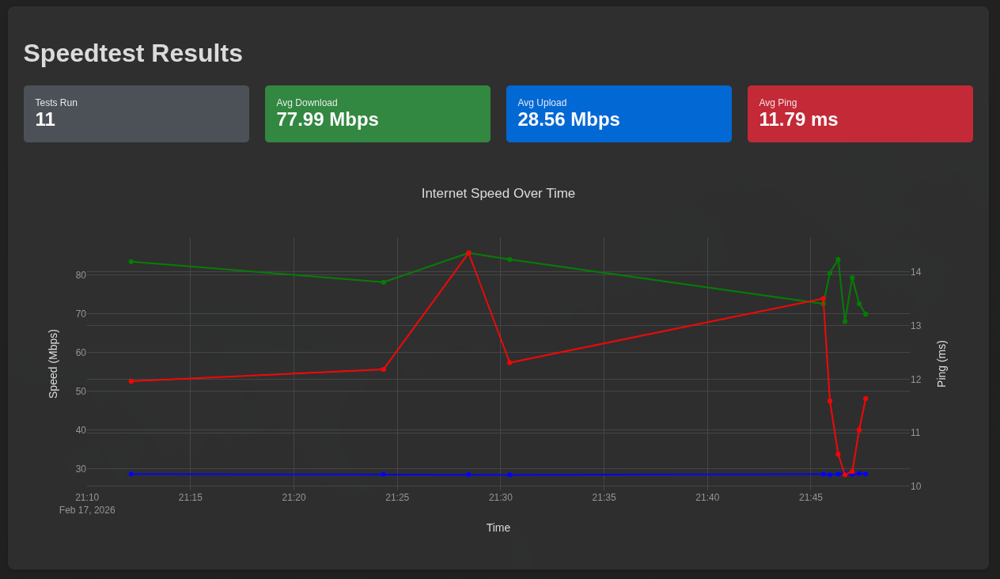

# Speedtest Docker

A lightweight Docker container (~35MB) that runs [Ookla Speedtest](https://www.speedtest.net/apps/cli) on a configurable cron schedule and serves interactive graphs via http.

[](https://hub.docker.com/r/thehale/speedtest)
[](https://github.com/thehale/speedtest/blob/master/LICENSE)
[](https://github.com/sponsors/thehale)
[](https://jhale.dev)
[](https://www.linkedin.com/comm/mynetwork/discovery-see-all?usecase=PEOPLE_FOLLOWS&followMember=thehale)




## Quick Start

### Using Docker Compose

Create a `docker-compose.yml` file:

```yaml
services:
  speedtest:
    image: thehale/speedtest:latest
    container_name: speedtest
    ports:
      - "8080:8080"
    volumes:
      - ./data:/data
    environment:
      - CRON_SCHEDULE=0 */5 * * *
    restart: unless-stopped
```

Then run:

```bash
docker-compose up --detach
```

Access the dashboard at http://localhost:8080

### Using Docker Run

```bash
docker run \
  --detach \
  --name speedtest \
  --publish 8080:8080 \
  --volume $(pwd)/data:/data \
  --env CRON_SCHEDULE="0 */5 * * *" \
  --restart unless-stopped \
  thehale/speedtest:latest
```

## Configuration

| Environment Variable | Default | Description |
|---------------------|---------|-------------|
| `CRON_SCHEDULE` | `0 */5 * * *` | Cron expression for test frequency |

### Cron Schedule Examples

- Every hour: `0 * * * *`
- Every 5 hours: `0 */5 * * *`
- Every 6 hours: `0 */6 * * *`
- Daily at midnight: `0 0 * * *`

You may find [crontab.guru](https://crontab.guru/) a helpful resource for building cron expressions.

## Data Persistence

The CSV file containing all speedtest results is stored at `/data/speedtest.csv` inside the container. Mount a volume to persist data:

```bash
--volume /path/to/data:/data
```

## Available Images

Images are published to both Docker Hub and GitHub Container Registry:

- **Docker Hub**: `docker.io/thehale/speedtest`
- **GitHub**: `ghcr.io/thehale/speedtest`

Available tags:
- `latest` - Most recent stable release
- `1.0.0`, `1.1.0`, etc. - Specific version tags

## Building from Source

```bash
docker build --tag speedtest .
```

## Architecture

- **Base image**: `nginxinc/nginx-unprivileged:alpine-slim` (~20MB)
- **Speedtest**: [Ookla's official CLI](https://www.speedtest.net/apps/cli)
- **Scheduling**: dcron (cron daemon)
- **Graphs**: Plotly.js (loaded from CDN) renders CSV data client-side
- **Security**: Runs as non-root user by default
- **Image size**: ~35MB total

## Viewing Logs

```bash
# Docker Compose
docker-compose logs --follow

# Docker
docker logs --follow speedtest
```

## License

This project is licensed under the Mozilla Public License 2.0 (MPL-2.0).
